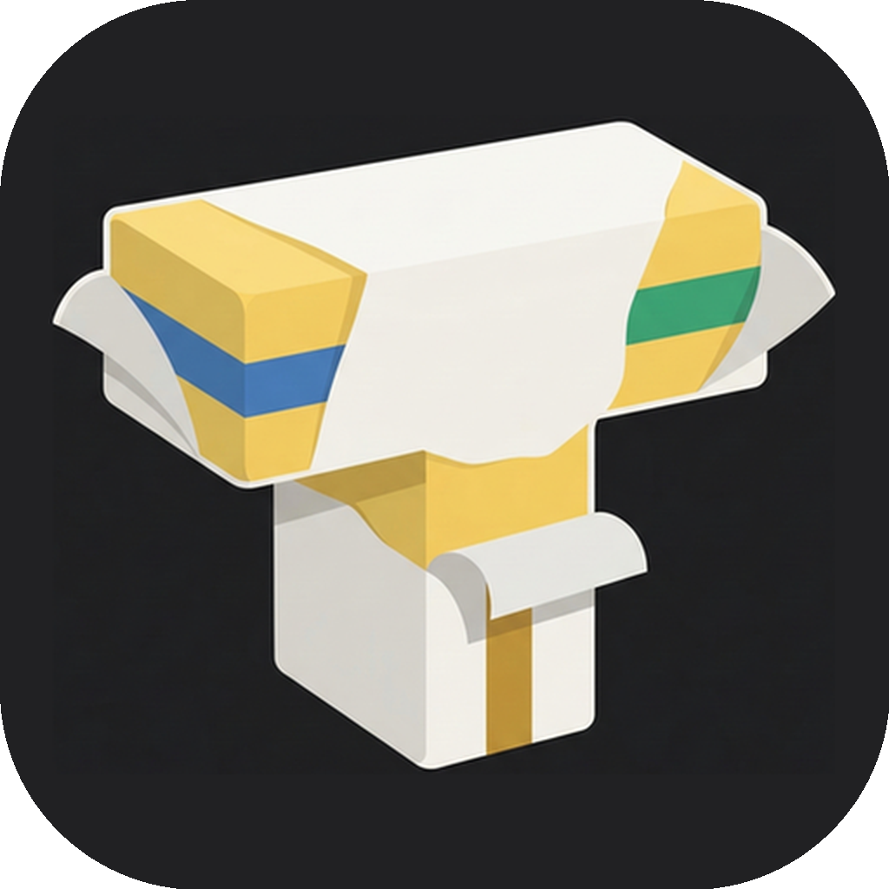
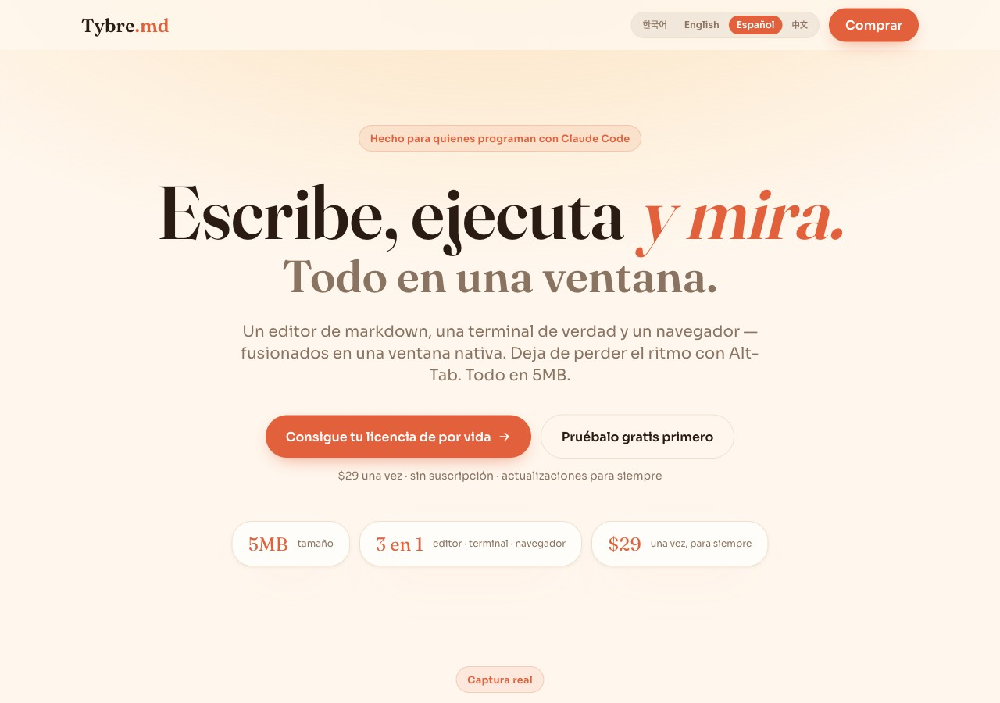
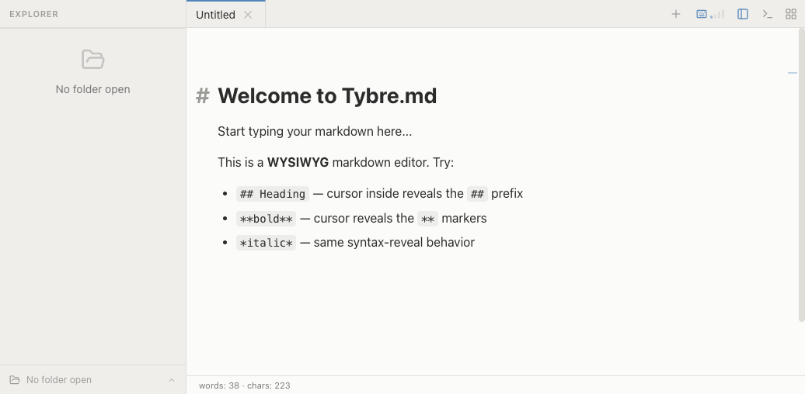

<div align="center">



# Tybre.md

### Escribe, ejecuta y mira — en una sola ventana. Sin cambiar de contexto.

Un editor de markdown, una **terminal de verdad** y un **navegador** — fusionados en una ventana nativa.
Deja de perder el ritmo con Alt-Tab. Todo en **5MB**.

[](https://github.com/Hyunki6040/tybre-md-releases/releases/latest)
[](#instalación)


[English](./README.md) · [한국어](./README.ko.md) · **Español** · [中文](./README.zh.md)

<br />



</div>

---

## 🤔 El problema

Programas con Claude Code, pero tu trabajo está repartido en varias ventanas:

- El editor de markdown en una ventana, la terminal en otra, el navegador en una tercera.
- **Alt-Tab, Alt-Tab, Alt-Tab** — pierdes la concentración en cada cambio.
- Una ventana (o app) nueva por proyecto, y `cd` para encontrar el directorio correcto.

Tybre.md reúne todo eso en **una sola ventana** que recuerda cada cosa.

| 😖 Antes | 🎯 Con Tybre |
|----------|--------------|
| Abrir una ventana/app por proyecto y buscarla con alt-tab | Cambia de proyecto al instante con `Ctrl+1–9` — en una ventana |
| Gestionar una terminal aparte para cada proyecto | La terminal integrada guarda una sesión **por proyecto** — una ventana |
| Hacer `cd` para encontrar el directorio del proyecto cada vez | Cambias y su ubicación, pestañas y terminal vuelven **como las dejaste** |

---

## ✨ Funciones

| | |
|---|---|
| 📝 **Markdown WYSIWYG** | Editor con sintaxis revelada sobre Milkdown. Lee prosa limpia y, al pasar el cursor, aparece el markup. Bloques de código con resaltado Shiki. |
| 🖥️ **Terminal integrada** | Terminal PTY completa con xterm.js. Ejecuta Claude Code, git, npm — sin salir de la ventana. Varias sesiones por proyecto. |
| 🌐 **Navegador en línea** | Previsualiza al instante con un panel de navegador y barra de URL. Se acabó el Alt-Tab a Chrome. |
| ⚡ **Cambio instantáneo de proyecto** | `Ctrl+1–9` para saltar entre proyectos. Cada uno guarda sus pestañas, sesiones de terminal y estado. |
| 💾 **Restaurar sesión** | Cierra y vuelve a abrir — cada proyecto, pestaña y terminal sigue justo donde lo dejaste. |
| 🪶 **Nativo · 5MB** | Build nativo con Tauri. Respuesta inmediata sin el peso de Electron. macOS (Apple Silicon e Intel) y Windows. |

---

## 📸 Captura

<div align="center">

<br />
<sub>WYSIWYG con sintaxis revelada — pasa el cursor para mostrar el markup <code>##</code>, con conteo de palabras y caracteres en vivo.</sub>
</div>

---

## ⚖️ Tybre vs. los demás

|  | **Tybre.md** | Typora | Obsidian | VS Code | Notion |
|--|:--:|:--:|:--:|:--:|:--:|
| Markdown WYSIWYG | ✅ | ✅ | 🟡 | ❌ | ✅ |
| Terminal integrada | ✅ | ❌ | 🟡 | ✅ | ❌ |
| Vista previa de navegador | ✅ | ❌ | 🟡 | 🟡 | ❌ |
| Nativo para Claude Code | ✅ | ❌ | ❌ | ❌ | ❌ |
| Cambio instantáneo de proyecto | ✅ | ❌ | 🟡 | 🟡 | ❌ |
| App nativa (< 10MB) | ✅ | ✅ | ❌ | ❌ | ❌ |
| Pago único | ✅ | ✅ | 🟡 | ✅ | ❌ |

<sub>✅ sí · 🟡 parcial · ❌ no</sub>

---

## 📦 Instalación

### macOS

Abre la **Terminal** y pega:

```bash
curl -fsSL https://raw.githubusercontent.com/Hyunki6040/tybre-md-releases/main/install.sh | bash
```

Compatible con **Apple Silicon (M1/M2/M3)** e **Intel**. Tras instalar, busca "Tybre" en Spotlight (⌘ Space).

### Windows

**PowerShell:**

```powershell
irm https://raw.githubusercontent.com/Hyunki6040/tybre-md-releases/main/install.ps1 | iex
```

**Símbolo del sistema (CMD):**

```batch
curl -fsSL https://raw.githubusercontent.com/Hyunki6040/tybre-md-releases/main/install.cmd -o install.cmd && install.cmd && del install.cmd
```

Instala la versión x64 en `%LOCALAPPDATA%\Programs` (sin permisos de administrador). Tras instalar, busca "Tybre" en el menú Inicio.

> ¿Prefieres un archivo? Descarga el instalador desde la [**última versión**](https://github.com/Hyunki6040/tybre-md-releases/releases/latest).

---

## 🔄 Actualización automática

Las actualizaciones llegan **automáticamente dentro de la app**. Cuando hay una versión nueva, aparece un aviso — pulsa **"Update now"** y Tybre se actualiza y se reinicia solo. Sin volver a descargar ni reinstalar.

---

## ⬇️ Descargas

Consulta la página de [**Releases**](https://github.com/Hyunki6040/tybre-md-releases/releases) para todas las versiones y registros de cambios.

| Plataforma | Archivo |
|------------|---------|
| macOS (Apple Silicon) | `Tybre.md_*_aarch64.dmg` |
| macOS (Intel) | `Tybre.md_*_x64.dmg` |
| Windows (x64) | `Tybre.md_*_x64-setup.exe` |

---

## ℹ️ Acerca de

Tybre.md está hecho con **Tauri v2 + React 19**. El código fuente se mantiene en un repositorio privado; este repositorio existe para distribuir los binarios públicos y el endpoint de actualización automática.

🇰🇷 Hecho en Corea por **Intense Lab**. Tybre.md es **software propietario — solo para uso personal y no comercial** (no es de código abierto). El uso comercial está prohibido sin permiso previo por escrito. Consulta [LICENSE](./LICENSE).
