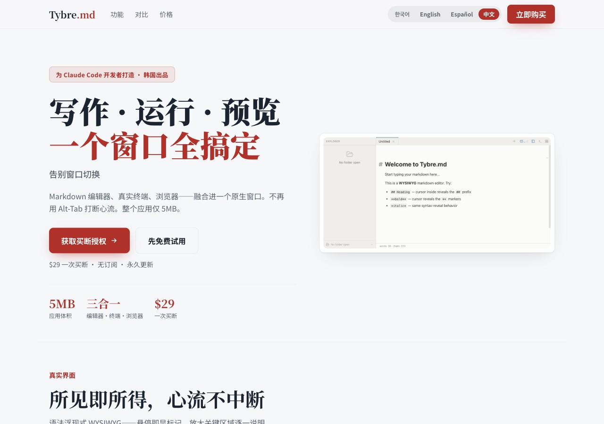

<div align="center">


# Tybre.md

### 写作、运行、预览 — 一个窗口搞定，告别窗口切换。

Markdown 编辑器、**真实终端**、**浏览器** — 融合进一个原生窗口。
不再用 Alt-Tab 打断心流。整个应用仅 **5MB**。

[](https://github.com/Hyunki6040/tybre-md-releases/releases/latest)
[](#安装)


[English](./README.md) · [한국어](./README.ko.md) · [Español](./README.es.md) · **中文**

<br />



</div>

---

## 🤔 痛点

用 Claude Code 开发时，你的工作散落在多个窗口里：

- Markdown 编辑器在一个窗口，终端在另一个，浏览器在第三个。
- **Alt-Tab、Alt-Tab、Alt-Tab** —— 每切换一次，专注力就流失一次。
- 每个项目开一个新窗口（或应用），还要 `cd` 找对目录。

Tybre.md 把这一切收进 **一个能记住所有状态的窗口**。

| 😖 以前 | 🎯 用 Tybre |
|---------|-------------|
| 每个项目开一个新窗口/应用，再 alt-tab 到处找 | 一个窗口里用 `Ctrl+1–9` 即时切换项目 |
| 为每个项目单独开一个终端窗口来管理 | 内置终端为**每个项目**保留会话 —— 只需一个窗口 |
| 每次都要 `cd` 去找项目目录 | 一切换，该项目的位置、标签页、终端**原样恢复** |

---

## ✨ 功能

| | |
|---|---|
| 📝 **所见即所得 Markdown** | 基于 Milkdown 的语法浮现编辑器。阅读时是干净排版，悬停即显标记。内置 Shiki 代码高亮。 |
| 🖥️ **内置终端** | 基于 xterm.js 的完整 PTY 终端。运行 Claude Code、git、npm，无需离开窗口。每个项目支持多会话。 |
| 🌐 **内嵌浏览器** | 内置带地址栏的浏览器面板，即时预览成果。不必再 Alt-Tab 到 Chrome。 |
| ⚡ **项目即时切换** | `Ctrl+1–9` 在项目间跳转。每个项目都保留自己的标签页、终端会话与工作区状态。 |
| 💾 **会话恢复** | 关闭再打开 —— 所有项目、标签页、终端状态都停留在你离开的位置。 |
| 🪶 **原生 · 5MB** | Tauri 原生构建。没有 Electron 的臃肿，响应即时。支持 macOS（Apple Silicon 与 Intel）和 Windows。 |

---

## 📸 截图

<div align="center">

<br />
<sub>语法浮现式 WYSIWYG —— 悬停一行即显 <code>##</code> 标记，并实时统计字数与字符数。</sub>
</div>

---

## ⚖️ Tybre 与其他工具对比

|  | **Tybre.md** | Typora | Obsidian | VS Code | Notion |
|--|:--:|:--:|:--:|:--:|:--:|
| 所见即所得 Markdown | ✅ | ✅ | 🟡 | ❌ | ✅ |
| 内置终端 | ✅ | ❌ | 🟡 | ✅ | ❌ |
| 内嵌浏览器预览 | ✅ | ❌ | 🟡 | 🟡 | ❌ |
| Claude Code 原生支持 | ✅ | ❌ | ❌ | ❌ | ❌ |
| 项目即时切换 | ✅ | ❌ | 🟡 | 🟡 | ❌ |
| 原生应用（< 10MB） | ✅ | ✅ | ❌ | ❌ | ❌ |
| 一次买断 | ✅ | ✅ | 🟡 | ✅ | ❌ |

<sub>✅ 支持 · 🟡 部分支持 · ❌ 不支持</sub>

---

## 📦 安装

### macOS

打开**终端**并粘贴：

```bash
curl -fsSL https://raw.githubusercontent.com/Hyunki6040/tybre-md-releases/main/install.sh | bash
```

支持 **Apple Silicon (M1/M2/M3)** 与 **Intel**。安装后在 Spotlight（⌘ Space）搜索 "Tybre"。

### Windows

**PowerShell：**

```powershell
irm https://raw.githubusercontent.com/Hyunki6040/tybre-md-releases/main/install.ps1 | iex
```

**命令提示符（CMD）：**

```batch
curl -fsSL https://raw.githubusercontent.com/Hyunki6040/tybre-md-releases/main/install.cmd -o install.cmd && install.cmd && del install.cmd
```

将 x64 版本安装到 `%LOCALAPPDATA%\Programs`（无需管理员权限）。安装后在开始菜单搜索 "Tybre"。

> 想用安装包？从[**最新版本**](https://github.com/Hyunki6040/tybre-md-releases/releases/latest)下载安装程序。

---

## 🔄 自动更新

更新在 **应用内自动** 推送。有新版本时会出现提示横幅 —— 点击 **"Update now"**，Tybre 会自行更新并重启。无需重新下载或安装。

---

## ⬇️ 下载

所有版本与更新日志见 [**Releases**](https://github.com/Hyunki6040/tybre-md-releases/releases) 页面。

| 平台 | 文件 |
|------|------|
| macOS (Apple Silicon) | `Tybre.md_*_aarch64.dmg` |
| macOS (Intel) | `Tybre.md_*_x64.dmg` |
| Windows (x64) | `Tybre.md_*_x64-setup.exe` |

---

## ℹ️ 关于

Tybre.md 使用 **Tauri v2 + React 19** 构建。源代码在私有仓库中维护；本仓库用于分发公开发行版二进制文件及自动更新端点。

🇰🇷 由 **Intense Lab** 在韩国打造。Tybre.md 为 **专有软件 —— 仅限个人非商业使用**（非开源）。未经事先书面许可，禁止商业使用。详见 [LICENSE](./LICENSE)。
